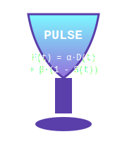

<!-- HERO (dark default) -->


<p align="center">
  <em>Prefer a light version?</em>
</p>

<details>
  <summary><strong>Show light hero</strong></summary>
  
</details>


<p align="center">
  
</p>


[](https://doi.org/10.5281/zenodo.17373002)
[](https://hkati.github.io/pulse-release-gates-0.1/)
[](https://hkati.github.io/pulse-release-gates-0.1/status.json)
[](https://hkati.github.io/pulse-release-gates-0.1/#quality-ledger)

**See the latest Quality Ledger (live):** https://hkati.github.io/pulse-release-gates-0.1/


### Project links (mirrors)

- **Repo:** https://github.com/HKati/pulse-release-gates-0.1
- **Live Quality Ledger:** https://hkati.github.io/pulse-release-gates-0.1/

- **Kaggle Dataset (EPF A/B artifacts, seeded) — DOI:** https://doi.org/10.34740/kaggle/dsv/13571702
- **Kaggle Dataset (baseline demo; deterministic, fail‑closed) — DOI:** https://doi.org/10.34740/kaggle/dsv/13571927

- **Kaggle Notebook (repro figures — EPF A/B, seeded):**
  https://www.kaggle.com/code/horvathkatalin/pulse-epf-shadow-a-b-reproduce-figures-seeded
- **Kaggle Notebook (offline quick start — Ledger & Q3+Q4):**
  https://www.kaggle.com/code/horvathkatalin/pulse-demo-offline-quick-start-q3-q4-ledger

- **DOI (versioned, Zenodo):** https://doi.org/10.5281/zenodo.17373002
- **DOI (concept, all versions, Zenodo):** https://doi.org/10.5281/zenodo.17214908

Releases: https://github.com/HKati/pulse-release-gates-0.1/releases


# PULSE — Release Gates for Safe & Useful AI

> 💡 **Continuous expansion**
>
> PULSE is not a frozen snapshot. The core release gate semantics are stable,
> but the safe pack, docs and examples are under active, ongoing expansion.
> Expect new profiles, detectors and ledger views to appear over time.

From **findings** to **fuses**. Run **PULSE before you ship**: deterministic, **fail-closed** gates that turn red-team insights into **release decisions** for both safety (I₂–I₇) and product utility (Q₁–Q₄). Offline, CI-enforced, audit-ready.

<p>
  
  
  
</p>

> **TL;DR**: Drop the pack → run → enforce → ship.  
> PULSE gives PASS/FAIL release gates, a human-readable **Quality Ledger**, and a stability signal (**RDSI**).

### What’s new

- **External detectors (opt‑in):** merge JSON/JSONL summaries from safety tools into the gate + Quality Ledger.
- **Refusal‑delta:** stability signal for refusal policies (audit‑friendly quantification).
- **JUnit & SARIF:** export artifacts for CI dashboards and code scanning.
- **First‑run stays simple:** defaults unchanged; optional pieces can be enabled later.

➡️ Full notes: see [Releases](https://github.com/HKati/pulse-release-gates-0.1/releases) and [CHANGELOG](./CHANGELOG.md).

---

## Quickstart

```console
python PULSE_safe_pack_v0/tools/run_all.py

python PULSE_safe_pack_v0/tools/check_gates.py \
  --status PULSE_safe_pack_v0/artifacts/status.json \
  --require pass_controls_refusal effect_present psf_monotonicity_ok psf_mono_shift_resilient \
    pass_controls_comm psf_commutativity_ok psf_comm_shift_resilient pass_controls_sanit \
    sanitization_effective sanit_shift_resilient psf_action_monotonicity_ok psf_idempotence_ok \
    psf_path_independence_ok psf_pii_monotonicity_ok q1_grounded_ok q2_consistency_ok \
    q3_fairness_ok q4_slo_ok


```

**See the latest Quality Ledger (live):** https://hkati.github.io/pulse-release-gates-0.1/

**Artifacts**
- **Report Card** → `PULSE_safe_pack_v0/artifacts/report_card.html`
- **Status JSON** → `PULSE_safe_pack_v0/artifacts/status.json`

### Developer tools (optional)

These helpers are intended for local validation and inspection; they do not
change any CI behaviour or gate logic.

- Trace dashboard demo notebook → `PULSE_safe_pack_v0/examples/trace_dashboard_v0.ipynb`
- Decision trace schema validator → `PULSE_safe_pack_v0/tools/validate_decision_trace_v0.py`  
  Validate `decision_trace_v0*.json` artefacts against
  `schemas/PULSE_decision_trace_v0.schema.json` using `jsonschema`.
- Memory / trace dashboard demo → `PULSE_safe_pack_v0/examples/PULSE_memory_trace_dashboard_v0_demo.ipynb`

### Try PULSE on your repo (5 minutes)

1. **Copy the pack** to your repo root:
   - `PULSE_safe_pack_v0/` (or unzip `PULSE_safe_pack_v0.zip`).

2. **Add the CI workflow**: copy `.github/workflows/pulse_ci.yml` from this repo.

3. **Run it**:
   - Open **Actions → PULSE CI → Run workflow** (or push a PR).
   - PULSE will generate: `status.json`, `report_card.html`, CI badges, and a PR comment.

**Ritual:** _Run PULSE before you ship._  
PULSE enforces fail‑closed PASS/FAIL gates across Safety (I₂–I₇), Quality (Q₁–Q₄), and SLO budgets, on archived logs.

---

## What PULSE checks

**Safety invariants (I₂–I₇)** — deterministic PASS/FAIL gates:
- Monotonicity (incl. shift-resilience)
- Commutativity (incl. shift-resilience)
- Sanitization effectiveness (incl. shift-resilience)
- Action-monotonicity, Idempotence, Path-independence
- PII-leak monotonicity

**Quality gates (Q₁–Q₄)** — product-facing guardrails:
- Q₁ **Groundedness** (RAG factuality)
- Q₂ **Consistency** (answer agreement)
- Q₃ **Fairness** (parity / equalized odds)
- Q₄ **SLOs** (p95 latency & cost budgets)

**Outputs**
- **Quality Ledger** (human-readable table in the report card)
- **RDSI** (Release Decision Stability Index) + Δ with CIs
- **Badges** (PASS/FAIL, RDSI, Q-Ledger) in `/badges/`

## Decision levels

**FAIL** (pipeline blocked) • **STAGE-PASS** (staging release) • **PROD-PASS** (production deploy allowed).  
Break‑glass overrides require justification; the justification is recorded in the Quality Ledger.

## Determinism (caveats)

PULSE is deterministic if the runner image + seeds + CPU/GPU mode are pinned. External detectors and GPU kernel variance can introduce flakiness; EPF (shadow) + RDSI quantify stability without ever changing CI outcomes.

## Native CI outputs

From `status.json`, PULSE exports **JUnit** (Tests tab) and **SARIF** (Security → Code scanning alerts) into `reports/` and uploads them as CI artifacts.

---

## CI — already wired

This repository ships with a single workflow: `.github/workflows/pulse_ci.yml`

It will:
1. locate/unzip the pack (`PULSE_safe_pack_v0/` or `PULSE_safe_pack_v0.zip`),
2. **run** the checks,
3. **enforce** (fail-closed) the required gates,
4. **augment** status with optional external detector summaries,
5. **update & commit** the SVG badges into `/badges/`,
6. **upload artifacts** (pulse-report: report card + status + badges),
7. on PRs, post a **Quality Ledger** comment.

> Tip: after making the repo **public**, add a **Branch protection rule** (Settings → Branches) and mark **PULSE CI** as a **required status check**.

---


## G‑field & shadow overlays

This repo now exposes a small “G‑field” surface as CI‑neutral overlays.  
They do **not** change any gates or release decisions; they only add extra
diagnostic layers on top of the existing PULSE status.

Current overlays:

- **G‑field overlay (`g_field_v0.json`)**  
  Snapshot of the internal G‑child field for recent traces / scenarios.  
  Produced by `scripts/g_child_field_adapter.py` from `hpc/g_snapshots.jsonl`
  (when present) and wired into the G‑field overlays (shadow) workflow.

- **G‑field stability overlay (`g_field_stability_v0.json`)**  
  Tiny synthetic example that shows how multiple `g_field_v0` runs can be
  summarized into a single stability view (number of runs, global mean/std,
  unstable gates, etc.).  
  Used only for schema validation and for the “Stability” section in the
  G‑snapshot report.

- **GPT external detection overlay (`gpt_external_detection_v0.json`)**  
  Sample view over `logs/model_invocations.jsonl`, counting how many
  internal‑HPC vs external GPT calls happened, broken down by vendor and model.  
  This is only a diagnostic shadow overlay; it does not enforce any policy.

Shadow workflows (GitHub Actions):

- **G‑field overlays (shadow)** – rebuilds `g_field_v0.json` from HPC snapshots.  
- **G‑EPF overlay (shadow)** – bridges EPF / Paradox outputs into a G‑EPF overlay.  
- **GPT external detection (shadow)** – scans `logs/model_invocations.jsonl`
  and emits `gpt_external_detection_v0.json`.  
- **Overlay schema validation (shadow)** – validates all overlays against
  their JSON Schemas.  
- **G snapshot report (shadow)** – renders a single `g_snapshot_report_v0.md`
  that summarizes which overlays are present and what they contain.

All of these are **fail‑closed only for their own job** (they never block the
main PULSE gates) and are meant as a safe playground for the internal G‑field
and GPT diagnostics.


---

## G snapshot report (v0)

PULSE ships a shadow workflow that summarizes internal G-field and GPT
external usage into a single markdown report.

- Workflow: **“G snapshot report (shadow)”** (GitHub Actions)
- Inputs (if present):
  - `g_field_v0.json` (G-child overlay)
  - `g_field_stability_v0.json` (stability overlay, optional)
  - `g_epf_overlay_v0.json` (EPF overlay, optional)
  - `gpt_external_detection_v0.json` (GPT sentinel overlay, built from
    `logs/model_invocations.jsonl`)
- Output artifact:
  - `PULSE_safe_pack_v0/artifacts/g_snapshot_report_v0.md`

The report shows, for each overlay, whether it is present/missing, plus:
basic G-field stats (mean/min/max) and GPT usage stats (internal vs
external calls, top vendors and models). It is CI-neutral and intended
for diagnostic and governance dashboards.

---

### Roadmap (shadow layer)

The current G-shadow layer is intentionally minimal: a small set of overlays and a
shadow-only snapshot report that can be shipped safely in the PULSE safe pack.
Next steps we are planning (non‑breaking, iterative) include:

- **EPF overlay 2.0**  
  Move from the current demo EPF panel to a more realistic EPF diagnostics overlay
  (richer fields, clearer mapping to gates, better summary in the snapshot report).

- **G‑field stability summaries**  
  Extend the `g_field_stability` overlay from a raw diagnostic JSON block to
  gate-level stability summaries and (optionally) simple historical trends.

- **GPT usage overlays**  
  Refine the GPT external detection overlay with scenario / product‑line breakdowns
  and clearer attribution of “internal vs external” usage in the snapshot.

- **Docs & UX for overlays**  
  Add short “how to add a new overlay” guidance and more snapshot examples, so that
  teams can plug in additional overlays without touching the core release gates.

---


### EPF (experimental, shadow-only)

**TL;DR:** Deterministic, fail-closed gates remain the source of truth for
releases. EPF runs as a seeded, auditable **shadow-only** layer and never
changes CI outcomes.

#### What is EPF?

EPF is an optional adaptive layer that only operates in a narrow band
around each gate threshold:

- inside `[threshold − ε, threshold]` it explores potential false-fail
  reduction and stability around the boundary;
- outside this band the existing semantics are unchanged:
  - value < `threshold − ε` → FAIL (shadow agrees with baseline),
  - insufficient evidence → DEFER/FAIL (shadow-only),
  - risk above `max_risk` → FAIL (shadow-only).

EPF is designed to be **CI-neutral**: it observes and logs, but does not
flip release decisions.

#### Stability signal (epf_L)

To reason about stability, EPF logs a contraction proxy for a gate-feedback
operator `F: X → X`:

- if `metrics.epf_L < 1`, the EPF layer is locally contractive on a window
  `W` around the gate;
- in that case the EPF report marks this as a **shadow pass**.

This signal is **diagnostic only** and never alters CI decisions.

The main fields are:

- `metrics.epf_L` in `status_epf.json`,
- an optional shadow ledger flag, e.g. `ledger.epf.shadow_pass`.

These are written by the EPF workflow and are **not** part of the baseline
`status.json` used for deterministic gating.

#### EPF experiment (shadow) workflow

The repository ships a non-blocking EPF experiment workflow:

- file: `.github/workflows/epf_experiment.yml`
- job name: **EPF experiment (shadow)**

It:

- runs `PULSE_safe_pack_v0/tools/run_all.py` (when available) to generate
  the baseline `PULSE_safe_pack_v0/artifacts/status.json`,
- copies this into a local `status.json` for the experiment,
- runs `check_gates.py` twice from the same baseline:
  - deterministic baseline → `status_baseline.json`,
  - EPF shadow → `status_epf.json`,
- compares the two and emits:
  - `epf_report.txt` – human-readable summary of baseline vs EPF decisions,
  - `epf_paradox_summary.json` – structured list of gates where EPF
    disagrees with baseline (paradox candidates).

The EPF experiment workflow is **optional and CI-neutral**. It is intended
for research and diagnostics (borderline gates, paradox analysis) and does
not participate in release gating.

For guidance on what to do when baseline and EPF disagree on specific
gates, see:

- `docs/PARADOX_RUNBOOK.md`

---

#### EPF hazard forecasting (proto-module)

The EPF safe pack also contains an experimental hazard-forecasting
probe in `PULSE_safe_pack_v0/epf/epf_hazard_forecast.py`. It computes
a simple early-warning index from the relationship between the current
EPF field and a stable reference state, and classifies the result into
GREEN / AMBER / RED zones. This module is prototype-only and does not
participate in release gating yet.

---

### EPF hazard overview (proto pipeline)

The EPF safe pack includes a proto-level, field-based hazard forecasting
pipeline that does **not** wait for concrete error events, but monitors
the relationship between the current EPF state and a stable reference.

The pipeline currently consists of:

- **Probe** – `PULSE_safe_pack_v0/epf/epf_hazard_forecast.py`  
  Computes a relational hazard signal from:
  - `T` – distance between current and baseline snapshot,
  - `S` – stability index,
  - `D` – short-horizon drift of `T`,
  - `E` – early-warning index and `zone` (`GREEN / AMBER / RED`),
  - `reason` – short explanation string.

- **Adapter & log** – `PULSE_safe_pack_v0/epf/epf_hazard_adapter.py`  
  Runs the probe from EPF experiments and appends results as JSONL lines
  to `PULSE_safe_pack_v0/artifacts/epf_hazard_log.jsonl`.

- **Inspector** – `PULSE_safe_pack_v0/tools/epf_hazard_inspect.py`  
  Summarises the JSONL log per gate/field (entry count, last zone/E,
  min/max/mean `E`) for quick CLI-based inspection.

- **Status integration** – `PULSE_safe_pack_v0/tools/run_all.py`  
  Exposes hazard metrics in `status.json["metrics"]` and in the HTML
  report card header:
  - `hazard_T`, `hazard_S`, `hazard_D`, `hazard_E`,
  - `hazard_zone`, `hazard_reason`,
  - `hazard_ok`, `hazard_severity`.

- **Gate policy helper** – `PULSE_safe_pack_v0/epf/epf_hazard_policy.py`  
  Derives a simple gate decision from `HazardState` using a RED-only
  blocking policy:
  - `hazard_ok` flag (True unless `zone == "RED"`),
  - `severity` (`LOW / MEDIUM / HIGH / UNKNOWN`),
  - preserving the underlying `reason` string.

In the current proto phase, the hazard signal is **diagnostic only**:
it is logged, inspected and surfaced in status/reporting, but does not
yet enforce any hard release gate.

---

> The EPF hazard signal is an early-warning layer on top of the usual
> pass/fail gates: it looks at how the field is drifting and destabilising
> before those drifts show up as hard failures. See the EPF hazard docs
> for details.

---

### EPF Relational Grail (hazard probe)

The **EPF Relational Grail** is the relational hazard layer in the PULSE EPF
stack: instead of waiting for a concrete error event, it monitors the
relationship between the current state and a reference state and produces a
scalar hazard index E(t) with GREEN / AMBER / RED zones.

For the conceptual overview, calibration flow and CLI examples, see
[docs/epf_relational_grail.md](docs/epf_relational_grail.md).

---

## EPF Relational Grail (hazard overlay)

The safe-pack emits an EPF hazard **diagnostic overlay** on top of deterministic gates.
It produces:
- `PULSE_safe_pack_v0/artifacts/status.json` (includes `hazard_*` metrics + shadow gate `epf_hazard_ok`)
- `PULSE_safe_pack_v0/artifacts/report_card.html` (human-friendly report)
- `PULSE_safe_pack_v0/artifacts/epf_hazard_log.jsonl` (append-only hazard series)

The hazard layer is field-first (metrics.* + gates.*), and surfaces a topology regime
(e.g. stably_good / unstably_good) without turning into a classic alerting system by default.
See `docs/epf_relational_grail.md` for details.

---

## PULSE–PD (experimental)

Paradox Diagram for decision-field analysis around selection cuts/θ (DS/MI/GF → PI). Includes a cut-based runner and a top‑PI CSV exporter (optionally with `event_id` or `run/lumi/event` for traceback). See [pulse_pd/README.md](pulse_pd/README.md) and [pulse_pd/EXPORT_SCHEMA.md](pulse_pd/EXPORT_SCHEMA.md).

---

### Artifacts

- `status_baseline.json` – deterministic decisions (source of truth)
- `status_epf.json` – EPF shadow metrics, traces & decisions (incl. `metrics.epf_L`)
- `epf_report.txt` – A/B diff summary of baseline vs EPF decisions
- `epf_paradox_summary.json` – structured summary (total gates, changed gates, sample baseline→EPF deltas)
- `epf_hazard_log.jsonl`  
  Line-oriented JSON log produced by the EPF hazard adapter. Each line
  is a single hazard probe event with the following structure:

      {
        "gate_id": "<gate-or-field-id>",
        "timestamp": "<iso-utc>",
        "hazard": {
          "T": 0.41,
          "S": 0.94,
          "D": 0.03,
          "E": 0.12,
          "zone": "GREEN",
          "reason": "E=0.120, T=0.410, S=0.940, D=0.030 → field stable, no near-term hazard signal."
        },
        "meta": {
          "run_id": "...",
          "commit": "...",
          "experiment_id": "..."
        }
      }

  Notes:
  - One line per probe invocation (per gate / per cycle).
  - `meta` is optional and may contain run-specific identifiers.
  - This artefact is **diagnostic only** in the proto phase: it is used
    for analysis and calibration of thresholds, not as a hard release
    gate.
  
---

### Optional config (per gate)
```yaml
gates:
  - id: q1_groundedness
    threshold: 0.85
    epsilon: 0.03     # enables the adaptive band
    adapt: true
    max_risk: 0.20
    ema_alpha: 0.20
    min_samples: 5
```

**CI:** EPF runs as a **separate, CI‑neutral** workflow (`.github/workflows/epf_experiment.yml`).  
Deterministic, fail‑closed gates in `check_gates.py` remain the **only** release gates.


---

### Repository layout

```
- `PULSE_safe_pack_v0/` – self-contained PULSE safe-pack v0 (tools, core
  policies and CI wiring; `pulse_policy.yml` is the CI source of truth)
- `profiles/` – example / experimental profiles and threshold sets. These
  are **not** used by CI unless explicitly referenced from
  `PULSE_safe_pack_v0/pulse_policy.yml` or custom workflows.

```

---

## Methods & external detectors

- **Methods (RDSI & Ledger):** `PULSE_safe_pack_v0/docs/METHODS_RDSI_QLEDGER.md`  
- **External detectors (optional):** `PULSE_safe_pack_v0/docs/EXTERNAL_DETECTORS.md`  
  - Plug-in adapters via simple JSON/JSONL summaries (e.g., Llama Guard, Prompt Guard, Garak, Azure Evaluations, Promptfoo, DeepEval).

---
Documentation map

In addition to this README, the following documents describe how the
PULSE v0 stack is wired in this repository:

- docs/STATE_v0.md  
  High-level snapshot of the current PULSE v0 state (core gates, EPF,
  external detectors, RDSI, drift, PR tooling, contributing).

- docs/PARADOX_RUNBOOK.md  
  Runbook for handling cases where EPF shadow decisions disagree with
  the deterministic baseline gates.

- docs/RDSI_STABILITY_NOTES.md  
  Notes on how to interpret the Release Decision Stability Index (RDSI)
  as a per-run stability signal, and what it does *not* cover.

- docs/DRIFT_OVERVIEW.md  
  Overview of how PULSE artefacts (gates, Quality Ledger, RDSI, EPF,
  external detectors) can be used in a broader drift/governance story.

- docs/PR_SUMMARY_TOOLS.md  
  Description of the PR summary tooling, and which script is considered
  canonical for Quality Ledger comments vs helper/example scripts.

- CONTRIBUTING.md  
  Contribution conventions (Conventional Commits, DCO, changelog, PR
  checklist) and how Codex (chatgpt-codex-connector) is used as an
  external AI reviewer on GitHub.

... 

## PULSE Topology v0 (Stability Map + Decision Engine + Dual View)

The topology layer is an optional, diagnostic overlay on top of the
deterministic PULSE release gates. It **never** changes `status.json` or
CI pass/fail behaviour; it only reads existing artefacts and produces extra
JSON and narrative views.

It consists of:

- **Stability Map v0** – aggregates `status.json` and optional EPF metrics
  into a stability score and stability type per run.
- **Decision Engine v0** – reads the Stability Map and produces a structured
  decision trace (BLOCK / STAGE_ONLY / PROD_OK + explanation).
- **Dual View v0** – a shared human + agent view of the same data
  (short narrative + machine‑friendly JSON).


## Docs & specs

**Topology v0 / Stability Map**

- `docs/PULSE_topology_v0_design_note.md`  
  – Topology v0 layer, Stability Map, states / transitions.
- `docs/PULSE_topology_v0_methods.md`  
  – CLI-level methods, including Stability Map v0 pipeline.
- `docs/PULSE_topology_v0_case_study.md`  
  – Real-world style case study for Topology v0.
- `schemas/PULSE_stability_map_v0.schema.json`  
  – Stability Map v0 JSON schema (includes `paradox_field_v0` and `epf_field_v0`).

**Paradox field & memory metrics v0**

- [PULSE memory / trace v0 walkthrough](docs/PULSE_memory_trace_v0_walkthrough.md) – end-to-end pipeline from EPF/paradox fields to history and dashboards.
- [PULSE paradox field and memory metrics v0](docs/PULSE_paradox_field_v0.md) – mathematical semantics for the paradox layer, tension/severity/priority and the memory fields.


**EPF shadow layer & paradox field**

- `docs/PULSE_topology_epf_hook.md`  
  – How EPF hooks into the topology conceptually.
- `docs/PULSE_epf_shadow_quickstart_v0.md`  
  – Short command-level guide to run the EPF shadow pipeline v0.
- `docs/PULSE_epf_shadow_pipeline_v0_walkthrough.md`  
  – Detailed walkthrough of the EPF shadow pipeline v0.
- `docs/PULSE_paradox_field_v0_walkthrough.md`  
  – How to read `paradox_field_v0` across artefacts.
- `docs/PULSE_paradox_field_v0_case_study.md`  
  – Concrete example for a single run.


**Paradox Resolution v0**

- `docs/PULSE_paradox_resolution_v0_design_note.md`  
  – Conceptual design for paradox triage / resolution.
- `docs/PULSE_paradox_resolution_v0_walkthrough.md`  
  – How `paradox_resolution_v0.json` is built and interpreted.


**Dashboards & memory**

- `docs/PULSE_topology_dashboards_v0_design_note.md`  
  – Topology dashboards v0 ideas.
- `docs/PULSE_memory_trace_summariser_v0_design_note.md`  
  – Memory / trace summariser v0 concept.


## Topology v0 and Decision Engine v0 

On top of the core PULSE gates and status artefacts, the repo ships an
optional **field / topology layer**. This layer never changes CI behaviour;
it only reads existing artefacts and emits additional overlays.

The main pieces are:

- **Paradox field (paradox_field_v0)**  
  - Schema: `schemas/PULSE_paradox_field_v0.schema.json`  
  - Tool: `PULSE_safe_pack_v0/tools/pulse_paradox_atoms_v0.py`  
  - Input: a directory with `status.json` artefacts  
  - Output: `paradox_field_v0.json` with *paradox atoms*
    (minimal unsatisfiable gate-sets) and a severity score.


- **Stability map (stability_map_v0, demo)**  
  - Tool: `PULSE_safe_pack_v0/tools/pulse_stability_map_demo_v0.py`  
  - Input: none (pure synthetic demo)  
  - Output: `stability_map_v0_demo.json` with a single 2×2 cell for the
    fairness–SLO–EPF example, including a simple Δ-curvature signal
    (`delta_bend`).


- **Decision Engine v0 (decision_engine_v0)**  
  - Tool: `PULSE_safe_pack_v0/tools/pulse_decision_engine_v0.py`  
  - Inputs:
    - a `status.json` artefact (required),
    - optional `stability_map_v0` and `paradox_field_v0` overlays.  
  - Output: `decision_engine_v0.json` with:
    - `release_state` (BLOCK / STAGE_ONLY / PROD_OK / UNKNOWN),
    - `stability_type` (e.g. stable_good / unstably_good),
    - compact summaries of gates, stability_map_v0 and paradox_field_v0.

These components are intended for **analysis, dashboards and governance**,
not for core gating. The source of truth for release decisions remains
`status.json` + `PULSE_safe_pack_v0/tools/check_gates.py` + the CI workflow.


For a detailed overview and examples, see:

  * `docs/PULSE_decision_field_v0_overview.md`
  * `docs/PULSE_decision_field_v0_5_minute_tour.md`
  * `docs/PULSE_topology_v0_mini_example_fairness_slo_epf.md`
  * `docs/PULSE_topology_v0_quickstart_decision_engine_v0.md`
  * `docs/PULSE_topology_v0_cli_demo.md`
  * `docs/PULSE_topology_v0_governance_patterns.md`
  * `docs/PULSE_demo_v1_paradox_stability_showcase.md`
  * `docs/PULSE_decision_engine_v0_unstably_good_example.md`
  * `docs/PULSE_decision_engine_v0_unstably_bad_example.md`
  * `docs/PULSE_decision_trace_v0_mini_example.md`
  * `docs/PULSE_mechanical_AI_v0.md`
  * `docs/PULSE_visual_map_v0.md`

---

**Future Library index**

- `docs/FUTURE_LIBRARY.md`  
  – Overview of the Future Library v0 pillars:
    - Topology v0 family
    - EPF signal layer (shadow-only)
    - Paradox Resolution v0
    - Topology dashboards v0
    - Memory / trace summariser v0
    - `docs/PULSE_memory_trace_v0_walkthrough.md` – Memory / trace v0 walkthrough and demo panels.

---

## Documentation

PULSE ships a few focused docs pages for people integrating the safe-pack
into CI/CD or audits:

- [`docs/status_json.md`](docs/status_json.md)  
  Overview of the `status.json` artefact: metrics, gates and how other
  tools consume it.

- [`docs/refusal_delta_gate.md`](docs/refusal_delta_gate.md)  
  Refusal delta summary format and the `refusal_delta_pass` gate, including
  fail‑closed behaviour when evaluations are missing.

- [`docs/external_detectors.md`](docs/external_detectors.md)  
  How external detector summaries (LlamaGuard, Promptfoo, Garak, Azure eval,
  Prompt Guard, …) are folded into `status.json` and the `external_all_pass`
  gate.

- [`docs/quality_ledger.md`](docs/quality_ledger.md)  
  Human‑facing PULSE Quality Ledger (report_card.html): layout, purpose and
  how it relates to `status.json`.


---

## How to cite

If you use this software, please cite the **versioned release** below.

- **Release DOI (versioned):** [10.5281/zenodo.17373002](https://doi.org/10.5281/zenodo.17373002)  
- **Concept DOI (all versions):** [10.5281/zenodo.17214908](https://doi.org/10.5281/zenodo.17214908)

### BibTeX
```bibtex
@software{pulse_v1_0_2,
  title        = {PULSE: Deterministic Release Gates for Safe \& Useful AI},
  author       = {Horvat, Katalin and EPLabsAI},
  year         = {2025},
  version      = {v1.0.2},
  doi          = {10.5281/zenodo.17373002},
  url          = {https://doi.org/10.5281/zenodo.17373002}
}

```

---

## Publication

[](https://doi.org/10.5281/zenodo.17833583)

This repository is accompanied by the cs.AI preprint:

> K. Horvat. *PULSE: Deterministic Release Gates for Safe & Useful AI*. Preprint, Zenodo, 2025.  
> DOI: [10.5281/zenodo.17833583](https://doi.org/10.5281/zenodo.17833583)

The preprint provides the mathematical and governance background for PULSE as a deterministic,
fail-closed release-governance layer for LLM applications, with:

- safety/consistency invariants (I2–I7),
- quality gates (Q1–Q4) with Wilson intervals and Newcombe deltas,
- SLO budgets on latency and cost,
- the Release-Decision Stability Index (RDSI),
- the Vacuum–energy Penalty Functional (EPF),
- and the paradox field notation `[(0 1)P]` for high-tension governance states.

This repository contains the reference implementation of the safe-pack, profiles, schemas, tools and
CI wiring corresponding to the preprint.


---

## Acknowledgments

This work used **ChatGPT (GPT‑5 Pro)** for drafting support, CI workflow tips, and repo‑hygiene suggestions.  
Human authors retain full responsibility for the design, verification, and decisions.

---

## Case studies & Radar

- [Lighthouse Case #1](PULSE_safe_pack_v0/docs/LIGHTHOUSE_CASE_1.md)
- [Competitor Radar (2025)](PULSE_safe_pack_v0/docs/COMPETITOR_RADAR_2025.md)

## License & contact


## License & contact

**License:** Apache‑2.0 — see [LICENSE](./LICENSE).  
**Contact:** [eplabsai@eplabsai.com](mailto:eplabsai@eplabsai.com?subject=PULSE%20inquiry) · [horkati65810@gmail.com](mailto:horkati65810@gmail.com?subject=PULSE%20inquiry)

**EPLabsAI — PULSE. From findings to fuses.**

<!-- docs: tidy EOF -->
