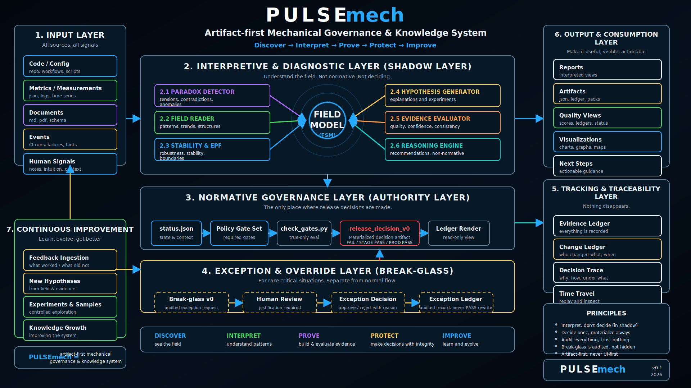
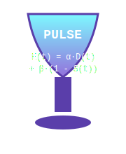

<!-- HERO / architecture orientation map -->


<details>
  <summary><strong>Project badges and live release surfaces</strong></summary>

  <p align="center">
    
  </p>

  <p align="center">
    
    <a href="https://hkati.github.io/pulse-release-gates-0.1/">
      
    </a>
    <a href="https://hkati.github.io/pulse-release-gates-0.1/status.json">
      
    </a>
    <a href="https://hkati.github.io/pulse-release-gates-0.1/#quality-ledger">
      
    </a>
  </p>

- **Quality Ledger:** https://hkati.github.io/pulse-release-gates-0.1/
- **Status JSON:** https://hkati.github.io/pulse-release-gates-0.1/status.json
</details>

# PULSE — Release Gates for Safe & Useful AI

#### Deterministic release-governance layer for LLM applications and AI-enabled systems

**See the latest Quality Ledger (live):** https://hkati.github.io/pulse-release-gates-0.1/

<  <a href="https://doi.org/10.5281/zenodo.17373002">
    
  </a>
</p>

PULSE is a deterministic, fail-closed release-governance layer for LLM applications and AI-enabled systems. It is built above existing application, model, evaluation, and deployment pipelines. At the release boundary, PULSE evaluates recorded release evidence against declared gate policy and emits an auditable release decision record.

Release evidence can include safety and consistency invariants, product quality gates, SLO budgets, external detector summaries, run metadata, logs, and release-stability signals. Policy defines which evidence and gates carry release authority. Evaluation is deterministic, explicit, and fail-closed.

The output is a governed release surface:
- machine-readable release status,
- enforced gate outcomes,
- a human-readable Quality Ledger,
- CI-native reports and artifacts,
- release-stability signals such as RDSI,
- traceable release-state records.

```text
recorded release evidence
+ declared gate policy
+ deterministic evaluator
→ auditable release decision record
```

Release gates are the deterministic enforcement mechanism inside the broader PULSE release-governance layer.


> 💡 **Continuous expansion**
>
> PULSE is not a frozen snapshot. The core release gate semantics are stable,
> but the safe pack, docs and examples are under active, ongoing expansion.
> Expect new profiles, detectors and ledger views to appear over time.

The normative release path is:

```text
release evidence
→ status.json
→ declared gate policy
→ check_gates.py
→ primary CI release workflow
→ release decision record
```

> **TL;DR**: Existing systems produce release evidence. PULSE binds that evidence to declared policy, evaluates it deterministically, enforces the release boundary in CI, and records the decision for audit.

---

## Start here

Choose one path first:

- **First run / adopter path** → [`docs/QUICKSTART_CORE_v0.md`](docs/QUICKSTART_CORE_v0.md)  
  Minimal path to run the core pipeline on a repo.

- **Release semantics / source-of-truth path** → [`docs/STATUS_CONTRACT.md`](docs/STATUS_CONTRACT.md) and [`docs/status_json.md`](docs/status_json.md)  
  Read these first if you need to understand what actually gates shipping.

- **Strict external evidence path** → [`docs/EXTERNAL_DETECTORS.md`](docs/EXTERNAL_DETECTORS.md) and [`docs/external_detector_summaries.md`](docs/external_detector_summaries.md)  
  Use these if external summaries must be present and fail closed in release-grade paths.

- **Triage / operational path** → [`docs/RUNBOOK.md`](docs/RUNBOOK.md)  
  Start here when CI is red and you need the shortest path to diagnosis.

- **Topology / authority-boundary path** → [`docs/SPACE_RELATION_MAP_v0.md`](docs/SPACE_RELATION_MAP_v0.md)
  Use this when you need the machine-readable topology view of PULSE:
  spaces, elements, placements, relations, and invariants.
  This layer is descriptive-only. It clarifies authority boundaries
  but does not define shipping decisions.

- **Topology / Paradox / EPF / overlays** → [`docs/OPTIONAL_LAYERS.md`](docs/OPTIONAL_LAYERS.md)  
  Use this after the core path. It maps diagnostic overlays, shadow workflows, and external companion surfaces such as Parameter Golf v0. These layers remain non-normative unless explicitly promoted into the required gate set. 

--- 

## Workflow map (2-minute orientation)

Before opening `.github/workflows/`, keep this split in mind:

- **Primary release gate**
  - `.github/workflows/pulse_ci.yml`
  - This is the primary release-gating workflow.

- **Repo / workflow guardrails**
  - Governance preflight and workflow validation checks
  - These protect repo and workflow integrity; they are not a second release-decision engine.

- **Shadow / diagnostic workflows**
  - Overlays, dry-runs, experiments, and extra diagnostic artifacts
  - They may validate their own contracts, but they do not change release outcomes by default.

- **Publication / GitHub-native surfaces**
  - Examples: SARIF upload, PR comments, badge write-back, Pages snapshots
  - These should remain separate opt-in workflows with explicit write permissions.

Rule:
Only the primary release-gating workflow changes release outcomes by default.
Shadow and publication workflows must stay non-normative unless explicitly promoted into the required gate set.

See also: [docs/WORKFLOW_MAP.md](docs/WORKFLOW_MAP.md)

---

### Shadow registry

PULSE includes a machine-readable shadow layer registry for governance-facing diagnostic surfaces.

Registered shadow layers remain non-normative by default: registry presence does not promote a layer into release authority and does not change `gates.*` semantics.

The registry uses explicit fixture-role buckets:

- `valid_fixtures` for contract-valid examples,
- `invalid_fixtures` for deliberate contract-breaking or consistency-failing examples,
- `fixtures` as a transitional alias for `valid_fixtures`.

`fixtures` and `valid_fixtures` must not be used together in the same layer entry.

---

## Clarity First (before Paradox / EPF / Topology work)

PULSE is deterministic and fail‑closed — but only if we keep the meaning of terms stable.
Before extending the Paradox diagram/field, EPF shadow layers, drift/history, or any UI/Pages surface, we lock down the semantics below.

**Source of truth (normative):**
Release decisions are defined only by:
- `PULSE_safe_pack_v0/tools/check_gates.py`
- `PULSE_safe_pack_v0/artifacts/status.json`
- `.github/workflows/pulse_ci.yml` (the required `--require ...` gate set)

**Diagnostic layers (CI‑neutral by default):**
Paradox/EPF/topology/G‑field overlays, hazard probes, drift reports, dashboards, and Pages views are diagnostic overlays unless explicitly promoted into the required gate set.

**Normative vs diagnostic (do not mix):**
- **Normative** = can block shipping (PASS/FAIL, STAGE‑PASS/PROD‑PASS).
- **Diagnostic** = explains/observes stability, tensions, and drift; it must not flip CI outcomes.

Rule: If a diagnostic artefact is missing, reports may show `MISSING/UNKNOWN`, but this must never be silently reinterpreted as `PASS`.

**No semantic drift rule:**
If you change the meaning of any signal/term (e.g. Atom/Edge/Orientation/Core/Anchor, EPF/RDSI/Δ, drift, hazard zones):
1) update the canonical docs (`docs/GLOSSARY_v0.md`, `docs/STATUS_CONTRACT.md`, `docs/STATE_v0.md`),
2) track and resolve the ambiguity in [`docs/AMBIGUITY_REGISTER_v0.md`](docs/AMBIGUITY_REGISTER_v0.md),
3) add or update a regression fixture proving determinism.

**UI / Pages rule:**
UI and Pages surfaces must be pure readers/renderers of immutable run artefacts. They must not compute or redefine release semantics.

---

### What’s new

- **External detectors (opt‑in):** merge JSON/JSONL summaries from safety tools into the gate + Quality Ledger.
- **Refusal‑delta:** stability signal for refusal policies (audit‑friendly quantification).
- **JUnit & SARIF:**  write `reports/junit.xml` and `reports/sarif.json` as workflow artifacts; an optional separate `upload_sarif.yml` workflow can publish SARIF into GitHub Code Scanning.
- **First‑run stays simple:** defaults unchanged; optional pieces can be enabled later.

➡️ Full notes: see [Releases](https://github.com/HKati/pulse-release-gates-0.1/releases) and [CHANGELOG](./CHANGELOG.md).

---

## Quickstart

There are two honest entry points.

### Fast local smoke (pack only)

```console
python PULSE_safe_pack_v0/tools/run_all.py
```

Use this for quick local inspection only.

It is useful when you want to:
- inspect the current artefact shape
- sanity-check that the pack runs locally
- look at the generated `status.json` / `report_card.html`

It is **not** the canonical Core CI reproduction path.

### Canonical Core lane

For the truthful Core first-run path, start with:

- `docs/QUICKSTART_CORE_v0.md`
- `docs/RUNBOOK.md`

That path is the canonical Core reference lane. It:
- runs the pack explicitly in `core` mode
- validates `status.json`
- materializes `core_required` from `pulse_gate_policy_v0.yml`
- enforces the required gates fail-closed

After a `core`-mode run, the canonical local gate check is:

```console
python PULSE_safe_pack_v0/tools/check_gates.py \
  --status PULSE_safe_pack_v0/artifacts/status.json \
  --require $(python tools/policy_to_require_args.py --policy pulse_gate_policy_v0.yml --set core_required)
```

### Optional diagnostics (shadow)

Some checks run as diagnostic/shadow signals (they may warn but should not block merges):

- **OpenAI Evals • Refusal smoke (shadow):** on PR/push it runs dry-run by policy (secrets are not exposed). The canonical output is written to: `openai_evals_v0/refusal_smoke_result.json` and uploaded as a workflow artifact in GitHub Actions.
- **Real runs** are only available via `workflow_dispatch` and require explicit confirmation/budget (see `openai_evals_v0/README.md`).

```console
python openai_evals_v0/run_refusal_smoke_to_pulse.py \
  --dry-run \
  --dataset openai_evals_v0/refusal_smoke.jsonl \
  --out openai_evals_v0/refusal_smoke_result.json \
  --status-json PULSE_safe_pack_v0/artifacts/status.json
```

### Relational Gain (shadow)

PULSE ships a Shadow-only relational gain module for checking whether local connections or closed cycles amplify deviation beyond the admitted bound.

This layer is diagnostic only:
- it does not emit a normative gate under `gates.*`
- it does not change release semantics
- it folds its result into `status.json` only under `meta.relational_gain_shadow`

Main components:

- checker: `PULSE_safe_pack_v0/tools/check_relational_gain.py`
- fold-in tool: `PULSE_safe_pack_v0/tools/fold_relational_gain_shadow.py`
- runner: `PULSE_safe_pack_v0/tools/run_relational_gain_shadow.py`
- workflow: `.github/workflows/relational_gain_shadow.yml`
- scope note: [docs/shadow_relational_gain_v0.md](docs/shadow_relational_gain_v0.md)
- rationale paper: [docs/papers/equivalence_drift_and_grounded_new_element.md](docs/papers/equivalence_drift_and_grounded_new_element.md)

Primary shadow artifact:

- `PULSE_safe_pack_v0/artifacts/relational_gain_shadow_v0.json`

Optional folded status surface:

- `status.json["meta"]["relational_gain_shadow"]`

Example local run:

```bash
python PULSE_safe_pack_v0/tools/run_relational_gain_shadow.py \
  --status PULSE_safe_pack_v0/artifacts/status.json \
  --input tests/fixtures/relational_gain_v0/pass.json \
  --artifact-out PULSE_safe_pack_v0/artifacts/relational_gain_shadow_v0.json \
  --status-out PULSE_safe_pack_v0/artifacts/status.relational_gain_shadow.json
```

Neutral-absence mode:

```bash
python PULSE_safe_pack_v0/tools/run_relational_gain_shadow.py \
  --status PULSE_safe_pack_v0/artifacts/status.json \
  --input PULSE_safe_pack_v0/artifacts/does_not_exist.json \
  --if-input-present \
  --artifact-out PULSE_safe_pack_v0/artifacts/relational_gain_shadow_v0.json \
  --status-out PULSE_safe_pack_v0/artifacts/status.relational_gain_shadow.absent.json
```

This module remains Shadow-only unless explicitly promoted later.

> Core path note
> If you only need deterministic release gating, stop after the Core path and continue with:
>
> - `docs/QUICKSTART_CORE_v0.md`
> - `docs/STATUS_CONTRACT.md`
> - `docs/status_json.md`
> - `docs/RUNBOOK.md`
>
> Optional overlays, shadow workflows, and publication surfaces are mapped here:
> [docs/OPTIONAL_LAYERS.md](docs/OPTIONAL_LAYERS.md)

### Debugging (when CI warns/fails)
If the OpenAI evals refusal smoke shadow workflow warns or fails, start here:
- Workflow: `.github/workflows/openai_evals_refusal_smoke_shadow.yml`
- Inspect the Step Summary and download artifacts from the run:
  - `openai_evals_v0/refusal_smoke_result.json`
  - `PULSE_safe_pack_v0/artifacts/status.json`

More details: see `openai_evals_v0/README.md` → “Debugging / triage (shadow)”.

---

**Artifacts**

**Report Card** → `PULSE_safe_pack_v0/artifacts/report_card.html`  
**Status JSON** → `PULSE_safe_pack_v0/artifacts/status.json`  
**Paradox Gate triage SVG (shadow)** → `PULSE_safe_pack_v0/artifacts/paradox_diagram_v0.svg` (Docs: [`docs/paradox_gate_triage_svg_v0.md`](docs/paradox_gate_triage_svg_v0.md))


### Developer tools (optional)

These helpers are intended for local validation and inspection; they do not
change any CI behaviour or gate logic.

- Trace dashboard demo notebook → `PULSE_safe_pack_v0/examples/trace_dashboard_v0.ipynb`
- Decision trace schema validator → `PULSE_safe_pack_v0/tools/validate_decision_trace_v0.py`  
  Validate `decision_trace_v0*.json` artefacts against
  `schemas/PULSE_decision_trace_v0.schema.json` using `jsonschema`.
- Memory / trace dashboard demo → `PULSE_safe_pack_v0/examples/PULSE_memory_trace_dashboard_v0_demo.ipynb`

### Try PULSE on your repo (5 minutes)

Pick one adoption shape first.

1. **Pack-only local smoke**
   - Copy `PULSE_safe_pack_v0/` into your repo root.
   - Run:
     ```console
     python PULSE_safe_pack_v0/tools/run_all.py
     ```
   - Good for local exploration and tool inspection.
   - Not the same as the canonical Core CI lane.

2. **Canonical Core lane**
   - Follow `docs/QUICKSTART_CORE_v0.md`.
   - Start with the documented Core slice and `.github/workflows/pulse_core_ci.yml`.
   - Use this path when you want the real deterministic first-adopter lane.

3. **Repo-level primary release gate**
   - Add `.github/workflows/pulse_ci.yml` only after the Core lane is understood and stable in your repo.
   - This is the primary release-gating workflow for the full repo path.
   - Release-grade runs use the workflow-effective gate set described in `docs/GATE_SETS.md`.

Ritual: Run PULSE before you ship.  
PULSE enforces fail‑closed PASS/FAIL gates across Safety (I₂–I₇), Quality (Q₁–Q₄), and SLO budgets, on archived logs.

---

## What PULSE checks

**Safety invariants (I₂–I₇)** — deterministic PASS/FAIL gates:
- Monotonicity (incl. shift-resilience)
- Commutativity (incl. shift-resilience)
- Sanitization effectiveness (incl. shift-resilience)
- Action-monotonicity, Idempotence, Path-independence
- PII-leak monotonicity

**Quality gates (Q₁–Q₄)** — product-facing guardrails:
- Q₁ **Groundedness** (RAG factuality)
- Q₂ **Consistency** (answer agreement)
- Q₃ **Fairness** (parity / equalized odds)
- Q₄ **SLOs** (p95 latency & cost budgets)

**Outputs**
- **Quality Ledger** (human-readable table in the report card)
- **RDSI** (Release Decision Stability Index) + Δ with CIs
- **Badges** (generated derivative artifacts; repository write-back is optional and disabled by default)

## Decision levels

**FAIL** (pipeline blocked) • **STAGE-PASS** (staging release) • **PROD-PASS** (production deploy allowed).  
Break‑glass overrides require justification; the justification is recorded in the Quality Ledger.


## Determinism (caveats)

PULSE is deterministic if the runner image + seeds + CPU/GPU mode are pinned. External detectors and GPU kernel variance can introduce flakiness; EPF (shadow) + RDSI quantify stability without ever changing CI outcomes.


## Native CI outputs

From `status.json`, PULSE can export **JUnit XML** and **SARIF** into `reports/` and upload them as CI artifacts.

- `reports/junit.xml` — JUnit XML for downstream test-report tooling / CI consumers.
- `reports/sarif.json` — SARIF for GitHub Code Scanning or any other SARIF consumer.

The primary `.github/workflows/pulse_ci.yml` workflow stays read-only and artifact-first. If you want GitHub-native code-scanning alerts, add the optional `.github/workflows/upload_sarif.yml` workflow.

---

## CI — primary gating workflow

The primary release-gating workflow is: `.github/workflows/pulse_ci.yml`

Other workflows in this repository may exist for shadow diagnostics, workflow validation, or research experiments; unless explicitly promoted into the required gate set, they do not change release outcomes.

### Auxiliary security workflows

The repository also ships auxiliary security workflows.

These are supporting hygiene / investigation / publication workflows.
They may scan, summarize, sanitize, or publish security findings, but they do not define shipping decisions unless they are explicitly promoted into the required gate set.

Current examples:

- `.github/workflows/gitleaks.yml`
  - Manual (`workflow_dispatch`) repository secret scan.
  - Advisory by default; uploads `gitleaks.sarif` as an artifact.

- `.github/workflows/secret_sweep.yml`
  - Manual working-tree grep for common secret-like patterns.
  - Soft warning helper; not the primary release gate.

- `.github/workflows/secret_history.yml`
  - Manual TruffleHog history scan.
  - Produces sanitized findings and summaries for review.

- `.github/workflows/secret_full_sweep.yml`
  - Manual deeper sweep across working tree and git history.
  - Intended for audit / cleanup / investigation support.

- `.github/workflows/upload_sarif.yml`
  - Optional publication workflow for SARIF into GitHub-native code-scanning surfaces.
  - Kept separate from the primary release-gating workflow.

Rule:
To understand what blocks shipping, start with `.github/workflows/pulse_ci.yml`.
Auxiliary security workflows support hygiene and review; they are not a second release-decision engine.

It will:

1. locate/unzip the pack (`PULSE_safe_pack_v0/` or `PULSE_safe_pack_v0.zip`),
2. **run** the checks,
3. **enforce** (fail-closed) the required gates,
4. **augment** status with optional external detector summaries,
5. **generate** derivative artifacts (for example ledger/report/badges) inside the run workspace,
6. **upload artifacts** (for example `status.json`, `report_card.html`, `reports/`, and generated badges when present),
7. keep **repository write-back disabled by default**.

Optional native publication — for example SARIF upload into GitHub Code Scanning — and other publish surfaces such as PR comments, badge commits, and Pages snapshots should be implemented in separate opt-in workflows with explicit write permissions.

## Governance preflight (fail‑closed)

In addition to running the pack, CI enforces repo‑level governance guards:

- **Semantic changelog enforcement:** if `pulse_gate_policy_v0.yml`, `metrics/specs/**`, or dataset‑manifest contracts change, `docs/policy/CHANGELOG.md` must include an entry under **Unreleased** documenting the change.
- **YAML duplicate‑key guard:** rejects duplicate mapping keys in `pulse_gate_registry_v0.yml` and `pulse_gate_policy_v0.yml` (prevents silent “last key wins” semantics).
- **Gate registry sync:** every gate emitted in `status.json` must be registered in `pulse_gate_registry_v0.yml`.
- **Policy ↔ registry consistency:** every gate required by policy must exist in the registry (including `core_required`).
- **Policy set selection:** `pull_request` runs, pushes to `main`, and default `workflow_dispatch` runs enforce `core_required`.
- **Human-readable gate-set summary:** [`docs/GATE_SETS.md`](docs/GATE_SETS.md) — Current `core_required` / `required` / `release_required` policy matrix and current workflow enforcement summary.
- **Strict external evidence:** workflow dispatch input `strict_external_evidence=true` **or** version tag pushes (`v*`/`V*`) keep an earlier workflow-level fail-closed presence check for external summaries before augmentation continues.
- **Note (default vs strict):** External detector summaries are opt-in. If no external summaries are provided, `external_all_pass` is computed as PASS by design in non-release paths. In release-grade paths, the effective enforced set is `required + release_required`, so external evidence presence and aggregate external pass are both part of the final fail-closed path.
- **Workflow YAML guard (workflow_lint.yml):** fail-closed validation of `.github/workflows/*.yml` to prevent broken workflow YAML (e.g., unquoted `:` in step names). 

> Tip: after making the repo **public**, add a **Branch protection rule** (Settings → Branches) and mark **PULSE CI** as a **required status check**.


---


## G‑field & shadow overlays

This repo now exposes a small “G‑field” surface as CI‑neutral overlays.  
They do **not** change any gates or release decisions; they only add extra diagnostic layers on top of the existing PULSE status.

Additional overlays:

- **G-field overlay (`g_field_v0.json`)**  
  Snapshot of the internal G-child field for recent traces / scenarios.  
  Produced by `scripts/g_child_field_adapter.py` from `hpc/g_snapshots.jsonl` (when present) and wired into the G-field overlays (shadow) workflow.

- **G‑field stability overlay (`g_field_stability_v0.json`)**  
  Small synthetic/demo shadow overlay that shows how multiple `g_field_v0` runs can be summarized into a single stability view (`num_runs`, global mean/std, unstable gates, etc.).  
  It now has a dedicated conservative contract checker: `scripts/check_g_field_stability_v0_contract.py`.  
  It also participates in the umbrella overlay schema validation sweep.  
  It remains **shadow-only** and does not change core release semantics.

- **GPT external detection overlay (`gpt_external_detection_v0.json`)**  
  Sample view over `logs/model_invocations.jsonl`, counting how many internal‑HPC vs external GPT calls happened, broken down by vendor and model.  
  This is only a diagnostic shadow overlay; it does not enforce any policy.

Shadow workflows (GitHub Actions):

- **G‑field overlays (shadow)** – rebuilds `g_field_v0.json` from HPC snapshots.
- **G‑EPF overlay (shadow)** – bridges EPF / Paradox outputs into a G‑EPF overlay.
- **GPT external detection (shadow)** – scans `logs/model_invocations.jsonl` and emits `gpt_external_detection_v0.json`.
- **Relational Gain (shadow)** – runs the relational gain checker, writes `relational_gain_shadow_v0.json`, and folds the result into `status.json["meta"]["relational_gain_shadow"]` without changing the current normative gate surface.
- **Overlay schema validation (shadow)** – validates current overlay artifacts against their JSON Schemas, including:
  - `g_field_v0`
  - `g_field_stability_v0`
  - `g_epf_overlay_v0`
  - `gpt_external_detection_v0`
  - `g_snapshot_report_v0`
  - `separation_phase_v0`
- **G snapshot report (shadow)** – builds paired markdown + JSON snapshot artifacts from the available shadow overlays and contract-checks the JSON report.

More shadow overlays:

- **Separation Phase overlay** (`separation_phase_v0.json`)  
  Snapshot-style diagnostic overlay that classifies the run into:
  `FIELD_STABLE` / `FIELD_STRAINED` / `FIELD_COLLAPSED` / `UNKNOWN`
  based on separation-style invariants (order stability, separation integrity, phase dependency).

> **CI-neutral diagnostic layer.**  
> It never blocks the main PULSE gates and must not change core release-gate semantics.

  - Docs: `docs/SEPARATION_PHASE_v0.md`
  - Schema: `schemas/separation_phase_v0.schema.json`
  - Adapter: `scripts/separation_phase_adapter_v0.py`
  - Contract check: `scripts/check_separation_phase_v0_contract.py`
  - Renderer (human summary): `scripts/render_separation_phase_overlay_v0_md.py`
  - Workflow: `.github/workflows/separation_phase_overlay.yml`
  - Output artifacts:
    - `PULSE_safe_pack_v0/artifacts/separation_phase_v0.json`
    - `PULSE_safe_pack_v0/artifacts/separation_phase_overlay_v0.md`

All of these are **fail‑closed only for their own job** (they never block the main PULSE gates) and are meant as a safe playground for the internal G‑field, EPF, separation-phase, and GPT diagnostics.

---

## Theory Overlay v0 (shadow)

Snapshot-style diagnostic overlay that computes and surfaces theory overlay signals
(incl. the record-horizon gate) as a CI-visible, contract-checked artifact and a
reviewer-friendly markdown summary.

> **CI-neutral diagnostic layer.**
> It never blocks the main PULSE gates and must not change core release-gate semantics.

- Docs: `docs/theory_overlay_v0.md`
- Schemas:
  - `schemas/theory_overlay_v0.schema.json`
  - `schemas/theory_overlay_inputs_v0.schema.json`
- Builder: `scripts/build_theory_overlay_inputs_v0.py`
- Generator: `scripts/generate_theory_overlay_v0.py`
- Contract checks:
  - `scripts/check_theory_overlay_inputs_v0_contract.py`
  - `scripts/check_theory_overlay_v0_contract.py`
- Renderer: `scripts/render_theory_overlay_v0_md.py`
- Workflow: `.github/workflows/theory_overlay_v0.yml`
- Output artifacts:
  - `PULSE_safe_pack_v0/artifacts/theory_overlay_inputs_v0.json`
  - `PULSE_safe_pack_v0/artifacts/theory_overlay_v0.json`
  - `PULSE_safe_pack_v0/artifacts/theory_overlay_v0.md`
- Tracked demo raw fixture:
  - `PULSE_safe_pack_v0/fixtures/theory_overlay_inputs_v0.raw.demo.json`

---

## OpenAI evals pilot (shadow, non-blocking)
We maintain a diagnostic “shadow” wiring for OpenAI Evals refusal smoke (v0).  
Workflow: `.github/workflows/openai_evals_refusal_smoke_shadow.yml`

- Push/PR: deterministic **dry-run** (no secrets, no network) + contract check + artifacts
- workflow_dispatch: optional **real** mode (requires secrets)

Artifacts typically include:
- `openai_evals_v0/refusal_smoke_result.json`
- `PULSE_safe_pack_v0/artifacts/status.json`
- `openai_evals_v0/refusal_smoke.jsonl`

---

## G snapshot report (v0)

PULSE ships a shadow workflow that summarizes internal G-field and GPT external usage into paired reviewer-facing and machine-readable snapshot artifacts.

- Workflow: **“G snapshot report (shadow)”** (GitHub Actions)
- Inputs (if present):
  - `g_field_v0.json` (G-child overlay)
  - `g_field_stability_v0.json` (stability overlay, optional)
  - `g_epf_overlay_v0.json` (EPF overlay, optional)
  - `gpt_external_detection_v0.json` (GPT sentinel overlay, built from `logs/model_invocations.jsonl`)
- Output artifacts:
  - `PULSE_safe_pack_v0/artifacts/g_snapshot_report_v0.md`
  - `PULSE_safe_pack_v0/artifacts/g_snapshot_report_v0.json`
- Contract check:
  - `scripts/check_g_snapshot_report_v0_contract.py`

The markdown artifact is the human-readable summary.  
The JSON artifact is the contract-checked machine-readable snapshot for downstream diagnostics and overlay validation.

This workflow remains **CI-neutral** and is intended for diagnostic and governance dashboards.  
It does not change core release outcomes.


---


### EPF (experimental, shadow-only)

**TL;DR:** Deterministic, fail-closed gates remain the source of truth for
releases. EPF runs as a seeded, auditable **shadow-only** layer and never
changes CI outcomes.

#### What is EPF?

EPF is an optional adaptive layer that only operates in a narrow band
around each gate threshold:

- inside `[threshold − ε, threshold]` it explores potential false-fail
  reduction and stability around the boundary;
- outside this band the existing semantics are unchanged:
  - value < `threshold − ε` → FAIL (shadow agrees with baseline),
  - insufficient evidence → DEFER/FAIL (shadow-only),
  - risk above `max_risk` → FAIL (shadow-only).

EPF is designed to be **CI-neutral**: it observes and logs, but does not
flip release decisions.

#### Stability signal (epf_L)

To reason about stability, EPF logs a contraction proxy for a gate-feedback
operator `F: X → X`:

- if `metrics.epf_L < 1`, the EPF layer is locally contractive on a window
  `W` around the gate;
- in that case the EPF report marks this as a **shadow pass**.

This signal is **diagnostic only** and never alters CI decisions.

The main fields are:

- `metrics.epf_L` in `status_epf.json`,
- an optional shadow ledger flag, e.g. `ledger.epf.shadow_pass`.

These are written by the EPF workflow and are **not** part of the baseline
`status.json` used for deterministic gating.

#### EPF experiment (shadow) workflow

The repository ships a non-blocking EPF experiment workflow:

- file: `.github/workflows/epf_experiment.yml`
- job name: **EPF experiment (shadow)**

It:

- runs `PULSE_safe_pack_v0/tools/run_all.py` (when available) to generate
  the baseline `PULSE_safe_pack_v0/artifacts/status.json`,
- copies this into a local `status.json` for the experiment,
- runs `check_gates.py` twice from the same baseline:
  - deterministic baseline → `status_baseline.json`,
  - EPF shadow → `status_epf.json`,
- compares the two and emits:
  - `epf_shadow_run_manifest.json` – primary registered EPF shadow run-manifest surface; diagnostic and non-normative
  - `epf_report.txt` – human-readable summary of baseline vs EPF decisions,
  - `epf_shadow_run_manifest.json` – primary registered EPF run-manifest surface,
  - `epf_paradox_summary.json` – secondary contract-hardened diagnostic summary.

The EPF experiment workflow is optional and CI-neutral. Its primary registered surface is the broader run manifest; the paradox summary remains a secondary diagnostic artifact. Neither surface participates in release gating unless explicitly promoted into the required gate set. 

For guidance on what to do when baseline and EPF disagree on specific
gates, see:

- `docs/PARADOX_RUNBOOK.md`

---

#### EPF hazard forecasting (proto-module)

The EPF safe pack also contains an experimental hazard-forecasting
probe in `PULSE_safe_pack_v0/epf/epf_hazard_forecast.py`. It computes
a simple early-warning index from the relationship between the current
EPF field and a stable reference state, and classifies the result into
GREEN / AMBER / RED zones. This module is prototype-only and does not
participate in release gating yet.

---

### EPF hazard overview (proto pipeline)

The EPF safe pack includes a proto-level, field-based hazard forecasting
pipeline that does **not** wait for concrete error events, but monitors
the relationship between the current EPF state and a stable reference.

The pipeline currently consists of:

- **Probe** – `PULSE_safe_pack_v0/epf/epf_hazard_forecast.py`  
  Computes a relational hazard signal from:
  - `T` – distance between current and baseline snapshot,
  - `S` – stability index,
  - `D` – short-horizon drift of `T`,
  - `E` – early-warning index and `zone` (`GREEN / AMBER / RED`),
  - `reason` – short explanation string.

- **Adapter & log** – `PULSE_safe_pack_v0/epf/epf_hazard_adapter.py`  
  Runs the probe from EPF experiments and appends results as JSONL lines
  to `PULSE_safe_pack_v0/artifacts/epf_hazard_log.jsonl`.

- **Inspector** – `PULSE_safe_pack_v0/tools/epf_hazard_inspect.py`  
  Summarises the JSONL log per gate/field (entry count, last zone/E,
  min/max/mean `E`) for quick CLI-based inspection.

- **Status integration** – `PULSE_safe_pack_v0/tools/run_all.py`  
  Exposes hazard metrics in `status.json["metrics"]` and in the HTML
  report card header:
  - `hazard_T`, `hazard_S`, `hazard_D`, `hazard_E`,
  - `hazard_zone`, `hazard_reason`,
  - `hazard_ok`, `hazard_severity`.

- **Gate policy helper** – `PULSE_safe_pack_v0/epf/epf_hazard_policy.py`  
  Derives a simple gate decision from `HazardState` using a RED-only
  blocking policy:
  - `hazard_ok` flag (True unless `zone == "RED"`),
  - `severity` (`LOW / MEDIUM / HIGH / UNKNOWN`),
  - preserving the underlying `reason` string.

In the current proto phase, the hazard signal is **diagnostic only**:
it is logged, inspected and surfaced in status/reporting, but does not
yet enforce any hard release gate.

---

> The EPF hazard signal is an early-warning layer on top of the usual
> pass/fail gates: it looks at how the field is drifting and destabilising
> before those drifts show up as hard failures. See the EPF hazard docs
> for details.

---

### EPF Relational Grail (hazard probe)

The **EPF Relational Grail** is the relational hazard layer in the PULSE EPF
stack: instead of waiting for a concrete error event, it monitors the
relationship between the current state and a reference state and produces a
scalar hazard index E(t) with GREEN / AMBER / RED zones.

For the conceptual overview, calibration flow and CLI examples, see
[docs/epf_relational_grail.md](docs/epf_relational_grail.md).

---

## EPF Relational Grail (hazard overlay)

The safe-pack emits an EPF hazard **diagnostic overlay** on top of deterministic gates.
It produces:
- `PULSE_safe_pack_v0/artifacts/status.json` (includes `hazard_*` metrics + shadow gate `epf_hazard_ok`)
- `PULSE_safe_pack_v0/artifacts/report_card.html` (human-friendly report)
- `PULSE_safe_pack_v0/artifacts/epf_hazard_log.jsonl` (append-only hazard series)

The hazard layer is field-first (metrics.* + gates.*), and surfaces a topology regime
(e.g. stably_good / unstably_good) without turning into a classic alerting system by default.
See `docs/epf_relational_grail.md` for details.

---

## PULSE–PD (experimental)

Paradox Diagram for decision-field analysis around selection cuts/θ (DS/MI/GF → PI). Includes a cut-based runner and a top‑PI CSV exporter (optionally with `event_id` or `run/lumi/event` for traceback). See [pulse_pd/README.md](pulse_pd/README.md) and [pulse_pd/EXPORT_SCHEMA.md](pulse_pd/EXPORT_SCHEMA.md).

---

### Artifacts

- `status_baseline.json` – deterministic decisions (source of truth)
- `status_epf.json` – EPF shadow metrics, traces & decisions (incl. `metrics.epf_L`)
- `epf_shadow_run_manifest.json` – primary registered EPF shadow run-manifest surface; diagnostic and non-normative
- `epf_report.txt` – A/B diff summary of baseline vs EPF decisions
- `epf_paradox_summary.json` – secondary contract-hardened EPF diagnostic summary
- `epf_hazard_log.jsonl`  
  Line-oriented JSON log produced by the EPF hazard adapter. Each line
  is a single hazard probe event with the following structure:

      {
        "gate_id": "<gate-or-field-id>",
        "timestamp": "<iso-utc>",
        "hazard": {
          "T": 0.41,
          "S": 0.94,
          "D": 0.03,
          "E": 0.12,
          "zone": "GREEN",
          "reason": "E=0.120, T=0.410, S=0.940, D=0.030 → field stable, no near-term hazard signal."
        },
        "meta": {
          "run_id": "...",
          "commit": "...",
          "experiment_id": "..."
        }
      }

  Notes:
  - One line per probe invocation (per gate / per cycle).
  - `meta` is optional and may contain run-specific identifiers.
  - This artefact is **diagnostic only** in the proto phase: it is used
    for analysis and calibration of thresholds, not as a hard release
    gate.
  
---

## Paradox field v0 (experimental, evidence-first)

This repo includes a minimal paradox layer artefact (`paradox_field_v0.json`) to summarize
run-to-run drift as **atoms** and **tension edges** (co-occurrence only, no causality).

- Generate atoms from a transitions drift directory:
  `python scripts/paradox_field_adapter_v0.py --transitions-dir tests/fixtures/transitions_gate_metric_tension_v0 --out out/paradox_field_v0.json`

- Fail-closed contract check (required fields, ordering, link integrity):
  `python scripts/check_paradox_field_v0_contract.py --in out/paradox_field_v0.json`

- Export evidence-first edges (JSONL):
  `python scripts/export_paradox_edges_v0.py --in out/paradox_field_v0.json --out out/paradox_edges_v0.jsonl`

Validate edges contract (including link/type integrity):
python scripts/check_paradox_edges_v0_contract.py --in out/paradox_edges_v0.jsonl --atoms out/paradox_field_v0.json

Reproducible non-fixture example inputs:
- docs/examples/README.md (includes docs/examples/transitions_case_study_v0/)
- docs/paradox_edges_case_studies.md

Reproducible non-fixture example (recommended)
- See: `docs/examples/transitions_case_study_v0/README.md`
- Repo-local + CI-friendly inputs; do not commit generated outputs under `out/**`.
- CI runs this example via `paradox_examples_smoke` to catch missing/renamed inputs early.

Notes:
- Do not commit generated outputs under out/**.

Edges are proven co-occurrences derived from atoms; they do not introduce new truth or causality.

---

### Optional config (per gate)
```yaml
gates:
  - id: q1_groundedness
    threshold: 0.85
    epsilon: 0.03     # enables the adaptive band
    adapt: true
    max_risk: 0.20
    ema_alpha: 0.20
    min_samples: 5
```

**CI:** EPF runs as a **separate, CI‑neutral** workflow (`.github/workflows/epf_experiment.yml`).  
Deterministic, fail‑closed gates in `check_gates.py` remain the **only** release gates.

---

### Paradox quick inspect (projection view)

The smoke workflow generates a deterministic Markdown summary for reviewers:

- `out/paradox_summary_v0.md` (case study)
- `out/empty_edges/paradox_summary_v0.md` (regression: empty edges with run_context)

Both are uploaded as the `paradox-artifacts` CI artifact.

Notes:
- Projection view only; does not affect CI gating.
- Edges are co-occurrence only (no causality).

Local quick inspect:

```bash
python scripts/inspect_paradox_v0.py \
  --field out/paradox_field_v0.json \
  --edges out/paradox_edges_v0.jsonl \
  --out out/paradox_summary_v0.md
```

---

### Repository layout

```
- `PULSE_safe_pack_v0/` – self-contained PULSE safe-pack v0 (tools, core
  policies and CI wiring; `pulse_policy.yml` is the CI source of truth)
- `profiles/` – example / experimental profiles and threshold sets. These
  are **not** used by CI unless explicitly referenced from
  `PULSE_safe_pack_v0/pulse_policy.yml` or custom workflows.

```

---

## Methods & external detectors

- **Methods (RDSI & Ledger):** `PULSE_safe_pack_v0/docs/METHODS_RDSI_QLEDGER.md`  
- **External detectors (optional):** `PULSE_safe_pack_v0/docs/EXTERNAL_DETECTORS.md`  
  - Plug-in adapters via simple JSON/JSONL summaries (e.g., Llama Guard, Prompt Guard, Garak, Azure Evaluations, Promptfoo, DeepEval).

---

## Deep docs  map

Start here:

- Running PULSE in CI: [docs/QUICKSTART_CORE_v0.md](docs/QUICKSTART_CORE_v0.md) — Minimal steps to run the core pipeline.
- Understanding the source of truth (`status.json`): [docs/status_json.md](docs/status_json.md) — How to read `status.json` (metrics, gates, consumers).
- When things fail (triage): [docs/RUNBOOK.md](docs/RUNBOOK.md) — Operational runbook for triage and reruns.

Curated entrypoints (repo-level docs under `docs/`):
> This list is intentionally curated (entrypoint-first).  
> Full documentation index: [docs/INDEX.md](docs/INDEX.md).

### Verified theory/probe path

- ✅ [docs/gravity_record_protocol_decodability_wall_v0_1.md](docs/gravity_record_protocol_decodability_wall_v0_1.md) — Decodability Wall spec (v0.1): operational threshold, file roles, canonical 4-step flow, fail-closed notes, and outputs.
- [docs/gravity_record_protocol_inputs_v0_1.md](docs/gravity_record_protocol_inputs_v0_1.md) — Gravity Record Protocol inputs bundle spec (v0.1).
- Demo fixtures: `PULSE_safe_pack_v0/fixtures/gravity_record_protocol_inputs_v0_1.demo.json`, `PULSE_safe_pack_v0/fixtures/decodability_wall_v0_1.demo.json`
- Green end-to-end demo path verified locally (repo root): build inputs → check inputs → build wall → check wall
- Generated local outputs: `out/gravity_record_protocol_inputs_v0_1.json`, `out/decodability_wall_v0_1.json`
- Verification summary: `sha_match = True`, `wall_errors = []`, `wall_state = wall_found`

### Orientation & contracts
- [docs/STATE_v0.md](docs/STATE_v0.md) — Current snapshot of PULSE v0 gates, signals, and tooling.
- [docs/STATUS_CONTRACT.md](docs/STATUS_CONTRACT.md) — Contract for `status.json` shape and semantics.
- [docs/GLOSSARY_v0.md](docs/GLOSSARY_v0.md) — Canonical term definitions used across docs.

### Shadow governance & contract surfaces
- [docs/WORKFLOW_MAP.md](docs/WORKFLOW_MAP.md) — Workflow authority map, including the shadow registry and EPF primary/secondary surfaces.
- [docs/shadow_layer_registry_v0.md](docs/shadow_layer_registry_v0.md) — Machine-readable shadow layer registry, fixture buckets, transitional alias semantics, and canonical self-check fixtures.
- [docs/SHADOW_CONTRACT_PROGRAM_v0.md](docs/SHADOW_CONTRACT_PROGRAM_v0.md) — Shadow contract program, staged hardening model, and fixture-matrix discipline.
- [docs/OPTIONAL_LAYERS.md](docs/OPTIONAL_LAYERS.md) — Non-normative optional layers, including Relational Gain and EPF shadow surfaces.

### Status, ledger & external signals
- [docs/quality_ledger.md](docs/quality_ledger.md) — Quality Ledger layout and purpose.
- [docs/refusal_delta_gate.md](docs/refusal_delta_gate.md) — Refusal-delta summary format + fail-closed semantics.
- [docs/EXTERNAL_DETECTORS.md](docs/EXTERNAL_DETECTORS.md) — External detectors policy & modes (gating vs advisory).
- [docs/external_detector_summaries.md](docs/external_detector_summaries.md) — Folding external detector summaries into status/ledger.


### Paradox field & edges
- [docs/PULSE_paradox_field_v0_walkthrough.md](docs/PULSE_paradox_field_v0_walkthrough.md) — How to read `paradox_field_v0`.
- [docs/Pulse_paradox_edges_v0_status.md](docs/Pulse_paradox_edges_v0_status.md) — Status/roadmap for `paradox_edges_v0.jsonl`.
- [docs/paradox_edges_case_studies.md](docs/paradox_edges_case_studies.md) — Case studies (fixture + non-fixture).
- [docs/PULSE_paradox_core_v0.md](docs/PULSE_paradox_core_v0.md) — Paradox Core v0 (deterministic core projection + markdown reviewer summary).

### EPF shadow & hazard diagnostics
- [docs/PULSE_epf_shadow_quickstart_v0.md](docs/PULSE_epf_shadow_quickstart_v0.md) — Command-level EPF shadow quickstart.
- [docs/epf_relational_grail.md](docs/epf_relational_grail.md) — Relational hazard overview + calibration/CLI examples.
- [docs/epf_hazard_inspect.md](docs/epf_hazard_inspect.md) — Inspect `epf_hazard_log.jsonl` from the CLI.

---

PULSE is designed as an artifact-first system: release decisions are derived from explicit, versioned artifacts rather than implicit runtime state.

### Topology & field-first interpretation
- [docs/PULSE_topology_overview_v0.md](docs/PULSE_topology_overview_v0.md) — Topology layer overview (diagnostic overlay).
- [docs/PULSE_decision_field_v0_overview.md](docs/PULSE_decision_field_v0_overview.md) — Decision field v0 overview.
- [docs/FIELD_FIRST_INTERPRETATION.md](docs/FIELD_FIRST_INTERPRETATION.md) — Field-first interpretation (question as projection).

### Examples & contributing
- [docs/examples/README.md](docs/examples/README.md) — Reproducible examples index.
- [docs/PR_SUMMARY_TOOLS.md](docs/PR_SUMMARY_TOOLS.md) — PR summary tooling (canonical scripts).
- [CONTRIBUTING.md](CONTRIBUTING.md) — Conventions, DCO, and review workflow.


... 

## PULSE Topology v0 (Stability Map + Decision Engine + Dual View)

The topology layer is an optional, diagnostic overlay on top of the
deterministic PULSE release gates. It **never** changes `status.json` or
CI pass/fail behaviour; it only reads existing artefacts and produces extra
JSON and narrative views.

It consists of:

  * Stability Map v0 — stability/topology diagnostic surface. The repo currently ships:
    * graph-style Stability Map (`states` + `transitions`) — schema/fixture
    * cell-style Stability Map (`cells` + `delta_bend`) — demo/tooling + Decision Engine summaries
  * Decision Engine v0 — reads `status.json` (required) plus optional overlays (stability map + paradox field) and emits `decision_engine_v0.json` (compact diagnostic summary). `decision_trace_v0*.json` is a separate dashboard/demo trace surface.
  * Dual View v0 — aligned human + machine view over the same archived artefact chain (short    narrative + machine-friendly JSON). 


## Docs & specs

**Topology v0 / Stability Map**

- `docs/PULSE_topology_v0_design_note.md`  
  – Topology v0 layer, Stability Map, states / transitions.
- `docs/PULSE_topology_v0_methods.md`  
  – CLI-level methods, including Stability Map v0 pipeline.
- `docs/PULSE_topology_v0_case_study.md`  
  – Real-world style case study for Topology v0.
  * `schemas/PULSE_stability_map_v0.schema.json`
– Graph-style Stability Map v0 JSON schema (`states` + `transitions`).
  * `schemas/PULSE_stability_map_cells_v0.schema.json`
– Cell-style Stability Map v0 JSON schema (`cells` + `delta_bend`; demo/tooling + Decision Engine summaries).

**Paradox field & memory metrics v0**

- [PULSE memory / trace v0 walkthrough](docs/PULSE_memory_trace_v0_walkthrough.md) – end-to-end pipeline from EPF/paradox fields to history and dashboards.
- [PULSE paradox field and memory metrics v0](docs/PULSE_paradox_field_v0.md) – mathematical semantics for the paradox layer, tension/severity/priority and the memory fields.


**EPF shadow layer & paradox field**

- `docs/PULSE_topology_epf_hook.md`  
  – How EPF hooks into the topology conceptually.
- `docs/PULSE_epf_shadow_quickstart_v0.md`  
  – Short command-level guide to run the EPF shadow pipeline v0.
- `docs/PULSE_epf_shadow_pipeline_v0_walkthrough.md`  
  – Detailed walkthrough of the EPF shadow pipeline v0.
- `docs/PULSE_paradox_field_v0_walkthrough.md`  
  – How to read `paradox_field_v0` across artefacts.
- `docs/PULSE_paradox_field_v0_case_study.md`  
  – Concrete example for a single run.


**Paradox Resolution v0**

- `docs/PULSE_paradox_resolution_v0_design_note.md`  
  – Conceptual design for paradox triage / resolution.
- `docs/PULSE_paradox_resolution_v0_walkthrough.md`  
  – How `paradox_resolution_v0.json` is built and interpreted.


**Dashboards & memory**

- `docs/PULSE_topology_dashboards_v0_design_note.md`  
  – Topology dashboards v0 ideas.
- `docs/PULSE_memory_trace_summariser_v0_design_note.md`  
  – Memory / trace summariser v0 concept.


## Topology v0 and Decision Engine v0 

On top of the core PULSE gates and status artefacts, the repo ships an
optional **field / topology layer**. This layer never changes CI behaviour;
it only reads existing artefacts and emits additional overlays.

The main pieces are:

- **Paradox field (paradox_field_v0)**  
  - Schema: `schemas/PULSE_paradox_field_v0.schema.json`  
  - Tool: `PULSE_safe_pack_v0/tools/pulse_paradox_atoms_v0.py`  
  - Input: a directory with `status.json` artefacts  
  - Output: `paradox_field_v0.json` with *paradox atoms*
    (minimal unsatisfiable gate-sets) and a severity score.


- **Stability map (stability_map_v0, demo)**  
  - Tool: `PULSE_safe_pack_v0/tools/pulse_stability_map_demo_v0.py`  
  - Input: none (pure synthetic demo)  
  - Output: `stability_map_v0_demo.json` with a single 2×2 cell for the
    fairness–SLO–EPF example, including a simple Δ-curvature signal
    (`delta_bend`).


- **Decision Engine v0 (decision_engine_v0)**  
  - Tool: `PULSE_safe_pack_v0/tools/pulse_decision_engine_v0.py`  
  - Inputs:
    - a `status.json` artefact (required),
    - optional `stability_map_v0` and `paradox_field_v0` overlays.  
  - Output: `decision_engine_v0.json` with:
    - `release_state` (BLOCK / STAGE_ONLY / PROD_OK / UNKNOWN),
    - `stability_type` (e.g. stable_good / unstably_good),
    - compact summaries of gates, stability_map_v0 and paradox_field_v0.

These components are intended for **analysis, dashboards and governance**,
not for core gating. The source of truth for release decisions remains
`status.json` + `PULSE_safe_pack_v0/tools/check_gates.py` + the CI workflow.


For a detailed overview and examples, see:

  * `docs/PULSE_decision_field_v0_overview.md`
  * `docs/PULSE_decision_field_v0_5_minute_tour.md`
  * `docs/PULSE_topology_v0_mini_example_fairness_slo_epf.md`
  * `docs/PULSE_topology_v0_quickstart_decision_engine_v0.md`
  * `docs/PULSE_topology_v0_cli_demo.md`
  * `docs/PULSE_topology_v0_governance_patterns.md`
  * `docs/PULSE_demo_v1_paradox_stability_showcase.md`
  * `docs/PULSE_decision_engine_v0_unstably_good_example.md`
  * `docs/PULSE_decision_engine_v0_unstably_bad_example.md`
  * `docs/PULSE_decision_trace_v0_mini_example.md`
  * `docs/PULSE_mechanical_AI_v0.md`
  * `docs/PULSE_visual_map_v0.md`

---

**Future Library index**

- `docs/FUTURE_LIBRARY.md`  
  – Overview of the Future Library v0 pillars:
    - Topology v0 family
    - EPF signal layer (shadow-only)
    - Paradox Resolution v0
    - Topology dashboards v0
    - Memory / trace summariser v0
    - `docs/PULSE_memory_trace_v0_walkthrough.md` – Memory / trace v0 walkthrough and demo panels.

---

## Core reference pages

For the shortest canonical references, start with:

- [`docs/status_json.md`](docs/status_json.md)
- [`docs/STATUS_CONTRACT.md`](docs/STATUS_CONTRACT.md)
- [`docs/EXTERNAL_DETECTORS.md`](docs/EXTERNAL_DETECTORS.md)
- [`docs/quality_ledger.md`](docs/quality_ledger.md)

### Q1 reference lane (shadow)
- [`docs/Q1_REFERENCE_TRACK.md`](docs/Q1_REFERENCE_TRACK.md) — Overview of the checked-in Q1 reference groundedness lane.
- `examples/q1_reference_input_manifest.json` — checked-in input manifest
- `examples/q1_reference_labels.pass_120.jsonl` — canonical pass fixture
- `examples/q1_groundedness_summary.example.json` — checked-in summary example
- `tests/test_q1_reference_golden_path.py` — end-to-end golden-path smoke

---

## How to cite

If you use this software, please cite the **versioned release** below.

- **Release DOI (versioned):** [10.5281/zenodo.17373002](https://doi.org/10.5281/zenodo.17373002)  
- **Concept DOI (all versions):** [10.5281/zenodo.17214908](https://doi.org/10.5281/zenodo.17214908)

### BibTeX
```bibtex
@software{pulse_v1_0_2,
  title        = {PULSE: Deterministic Release Gates for Safe \& Useful AI},
  author       = {Horvat, Katalin and EPLabsAI},
  year         = {2025},
  version      = {v1.0.2},
  doi          = {10.5281/zenodo.17373002},
  url          = {https://doi.org/10.5281/zenodo.17373002}
}

```

---

## Publication

[](https://doi.org/10.5281/zenodo.17833583)

This repository is accompanied by the cs.AI preprint:

> K. Horvat. *PULSE: Deterministic Release Gates for Safe & Useful AI*. Preprint, Zenodo, 2025.  
> DOI: [10.5281/zenodo.17833583](https://doi.org/10.5281/zenodo.17833583)

The preprint provides the mathematical and governance background for PULSE as a deterministic,
fail-closed release-governance layer for LLM applications, with:

- safety/consistency invariants (I2–I7),
- quality gates (Q1–Q4) with Wilson intervals and Newcombe deltas,
- SLO budgets on latency and cost,
- the Release-Decision Stability Index (RDSI),
- the Vacuum–energy Penalty Functional (EPF),
- and the paradox field notation `[(0 1)P]` for high-tension governance states.

This repository contains the reference implementation of the safe-pack, profiles, schemas, tools and
CI wiring corresponding to the preprint.

---

## Research / publication links

<details>
<summary><strong>Mirrors, datasets, notebooks, DOI, releases, and live Pages surfaces</strong></summary>

- **Repo:** https://github.com/HKati/pulse-release-gates-0.1
- **Live Quality Ledger:** https://hkati.github.io/pulse-release-gates-0.1/

- **Kaggle Dataset (EPF A/B artifacts, seeded) — DOI:** https://doi.org/10.34740/kaggle/dsv/13571702
- **Kaggle Dataset (PULSE: deterministic, fail-closed release gates) — DOI:** https://doi.org/10.34740/kaggle/dsv/13519727

- **Kaggle Notebook (repro figures — EPF A/B, seeded):** https://www.kaggle.com/code/horvathkatalin/pulse-epf-shadow-a-b-reproduce-figures-seeded
- **Kaggle Notebook (offline quick start — Ledger & Q3+Q4):** https://www.kaggle.com/code/horvathkatalin/pulse-demo-offline-quick-start-q3-q4-ledger

- **DOI (versioned, Zenodo):** https://doi.org/10.5281/zenodo.17373002
- **DOI (concept, all versions, Zenodo):** https://doi.org/10.5281/zenodo.17214908

- **Releases:** https://github.com/HKati/pulse-release-gates-0.1/releases

- **Paradox Core (shadow reviewer surface):** https://hkati.github.io/pulse-release-gates-0.1/paradox/core/v0/
  - Deterministic, CI-neutral by default (diagnostic overlay).
  - Edges are non-causal (co-occurrence/association only).
  - Provenance (source selection): https://hkati.github.io/pulse-release-gates-0.1/paradox/core/v0/source_v0.json

</details>

---

## Acknowledgments

PULSE is developed through human–machine collaboration, including ChatGPT support for drafting, CI workflow refinement, and repo-hygiene suggestions.
Human authors retain full responsibility for the design, verification, and release decisions.

---

## Case studies & Radar

- [Lighthouse Case #1](PULSE_safe_pack_v0/docs/LIGHTHOUSE_CASE_1.md)
- [Competitor Radar (2025)](PULSE_safe_pack_v0/docs/COMPETITOR_RADAR_2025.md)

## License & contact

**License:** Apache‑2.0 — see [LICENSE](./LICENSE).  
**Contact:** [eplabsai@eplabsai.com](mailto:eplabsai@eplabsai.com?subject=PULSE%20inquiry) · [horkati65810@gmail.com](mailto:horkati65810@gmail.com?subject=PULSE%20inquiry)

**EPLabsAI — PULSE. From findings to fuses.**

<!-- docs: tidy EOF -->
